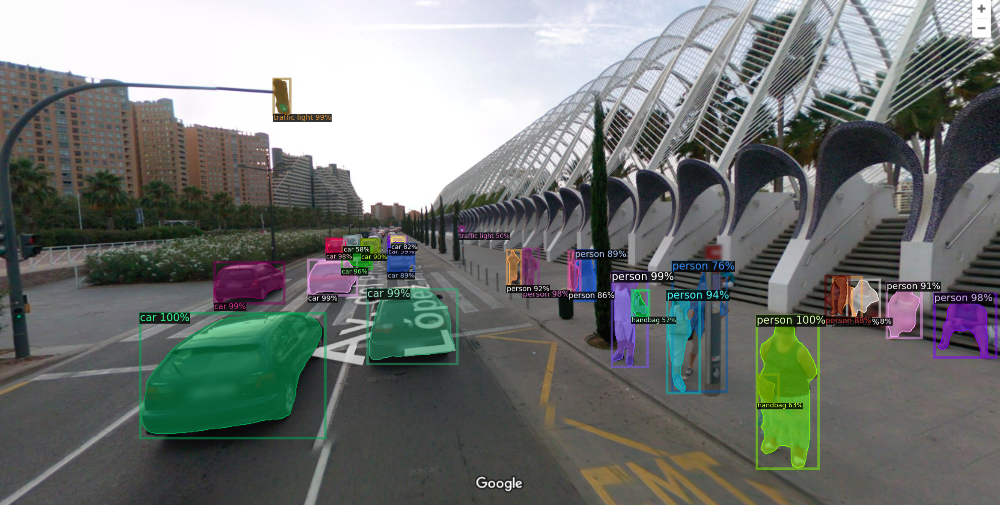

# Detectron2-Facebook-COCO-dataset
Easy CPU implementation of the Facebook's Detectron2 object detector.

Found a easy enough implementation that I would recommend everyone to try it out. The article is https://towardsdatascience.com/a-beginners-guide-to-object-detection-and-computer-vision-with-facebook-s-detectron2-700b6273390e and the setup is quite straight-forward.
Amazing results, of course. Beautiful images and posibilities.

